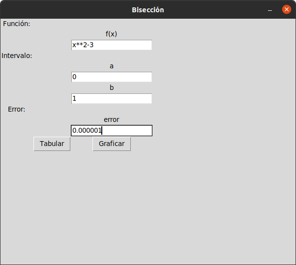
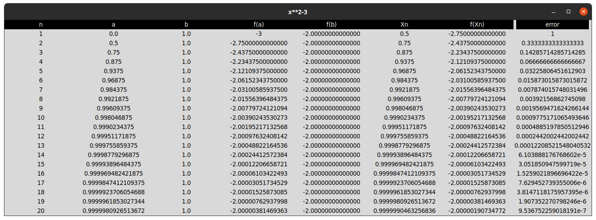

# Jamipy

Jamipy es un software creado con el propósito de ayudar a la comunidad estudiantil de Acatlán (y probablemente otras universidades) a entender y resolver algunos de los métodos vistos en el aula.
Fue elaborado en python y java.


## Documentación
---
Para poder usar el software necesitas alguna función en términos de x. En cualquiera de los métodos la necesitarás. Ej. 

***f(x) = x² - 3***

Dependiendo el método elegido, te pedirá dos puntos (a y b)
que es un intervalo de dicha función, o solo un punto (a)
que es una aproximación a la solución de esa ecuación. Ej.

***a = 0***

***b = 1***

Y un error, que es la diferencia que quieres entre la
solución real y la solución que te dará el software.
Debe ser menor a 1. Ej.

***error = 10-⁶***

Implementando todo eso en el software se vería algo así:



Como se puede notar en la imagen, necesitamos algunos 
caracteres especiales para su funcionamiento adecuado que se mostrarán a continuación.

| Función/Operador | Símbolo | Ejemplo de uso | Significado |
|------------------|---------|----------------|------------:|
|    Potencia      |  **     |   x**2         |     x²      |
|    Producto      |   *     |   3*x          |     3x      |
| Producto y potencia|  * ** |   3*x**2       |     3x²     |
| Seno             |  sin()  |    sin(x)      |  sen(x)     |
| Coseno           |  cos()  |    cos(x)      |   cos(x)    |
| Tangente         |  tan()  |    tan(x)      |   tan(x)    |
| Logaritmo Natural|  log()  |    log(x)      |   ln(x)     |
| Logaritmo base 10|  log10()|    log10(x)    |   log(x)    |

Para ejecutar el método, pulsa el botón *tabular* y aparecerá
una nueva ventana con las iteraciones para llegar a la
solución.

*Por el momento el botón Graficar no está habilitado.*




## Instalación
---
### Pre-requisitos
* [Python](python.org)
* [Java](https://www.oracle.com/java/technologies/javase-jdk8-downloads.html)

1. Clona el repositorio https://github.com/mikenavarroro/MetodosNumericos.git en tu computadra.
2. Instala las librerías de python
    * Numpy
    * Sympy
    * Matplotlib
    * Tkinter (solo si no usas Windows)

    Linux, macOS, Windows

     ```
     ~$ pip install numpy
     ```
    Linux, macOS, Windows
     ```
     ~$ pip install sympy
     ```
    Linux, macOS, Windows
     ```
     ~$ pip install matplotlib
     ```
    Linux(Ubuntu 18.04 o posterior)
     ```
     ~$ sudo apt install python3-tk
     ```

3. Compila y ejecuta el archivo *Principal.java*

### Elaborado para
---
* Windows
* Linux (en proceso)
* macOS (en proceso)

### Elaborado en
---
* Windows 10.
* Actualizando actualmente en Linux Ubuntu 20.04 LTS

### Autor(es)
---
* [Miguel Ángel Navarro Rodríguez](https://twitter.com/MikeNavarroR)
* [Mauricio Lopez Servín](https://twitter.com/mauIntensivDrip)